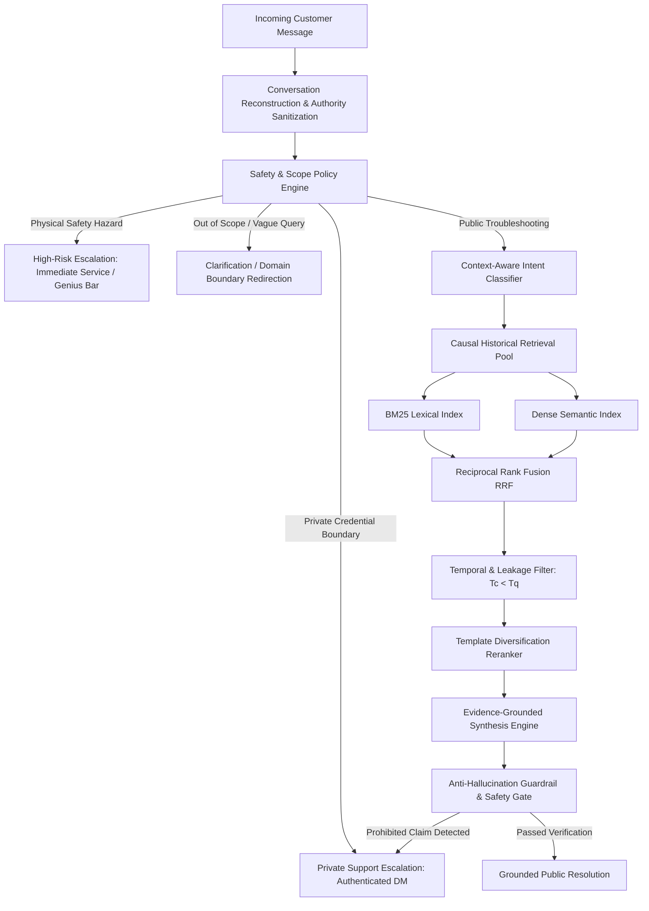
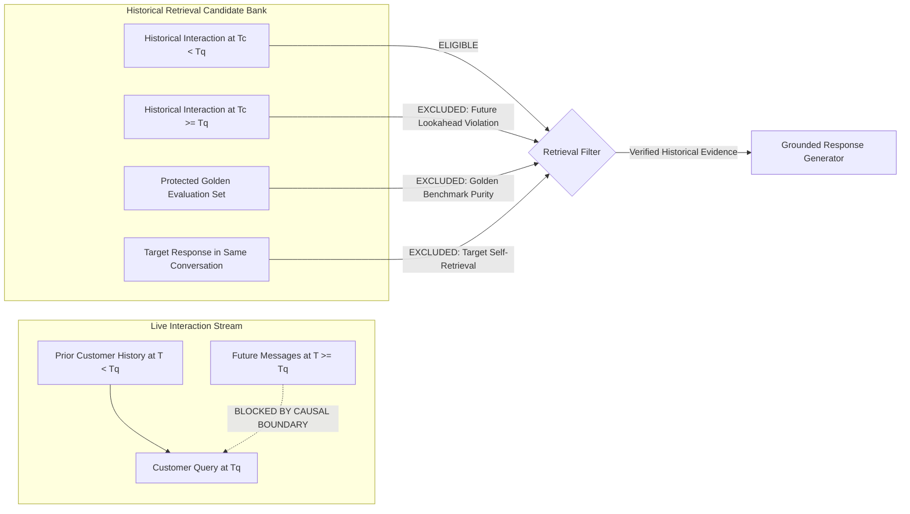

# AppleSupport Causal Support Agent

### Temporal, safety-aware support generation from real historical conversations.

[](https://www.python.org/downloads/)
[](tests/)
[](evaluations/golden_set/)
[](LICENSE)
[](scripts/evaluate_phase6_5.py)

Most support RAG systems treat historical conversations as documents.

This project treats them as something more constrained:

**time-ordered interactions between customers and support.**

That distinction matters.

If a system retrieves a support response that happened **AFTER** the customer question it is supposed to answer, it has learned from the future.

If it concatenates another customer's conversation into the current context, it has leaked private context.

If it treats a customer's quoted third-party statement as authoritative Apple Support evidence, it can generate a convincing but unsupported answer.

This project therefore builds the support agent around:

**causal context + constrained retrieval + evidence authority + safety-aware escalation.**

> *Historical support data is not just a document corpus. It is a temporal interaction system.*

---

## The Problem

The Hiver Take-Home Assignment tasks an engineer with building an enterprise AI customer support agent for Twitter data that must:
1. **Classify incoming customer messages** into a small, actionable intent taxonomy derived directly from the data.
2. **Draft a helpful, grounded reply** based on how the brand historically resolved similar customer issues.
3. **Decide whether to auto-handle or escalate** to a human agent, providing an explicit, operational reason.

Crucially, the assignment dictates: *"The proof is worth more than the system."* Rather than prioritizing inflated marketing claims or opaque zero-shot prompts, this submission prioritizes **methodological integrity, causal non-leakage, reproducible baselines, and honest failure analysis.**

---

## Why Naive RAG Fails in Production Support

Standard LLM and RAG tutorials assume that support logs can be indexed like Wikipedia articles. In real-world enterprise customer support, this naive approach collapses:

| Approach | Fundamental Production Failure | Solution in Causal SupportAgent |
| :--- | :--- | :--- |
| **Similarity-only vector search** | **Temporal Lookahead Leakage**: Retrieves historical responses timestamped *after* the incoming query ($T_c \ge T_q$), allowing the model to "learn from the future." | **Causal Filter**: Strictly rejects any candidate with $T_{\text{candidate}} \ge T_{\text{query}}$ (`src/retrieval/filter.py`). |
| **Raw thread concatenation** | **Context & Identity Leakage**: Unrelated customer identifiers, device serials, or private complaints bleed into prompt context. | **Conversation & Customer Partitioning**: Invariant isolation enforced across train/dev/test splits. |
| **Customer text as evidence** | **Authority Inversion**: Customer guesses (*"A forum said to microwave the battery"*) are indexed as verified brand policy. | **Evidence Authority Model**: Only verified `@AppleSupport` turns are admitted as authoritative evidence. |
| **Third-party text as evidence** | **External Contamination**: Mentions of external accounts (`@TechGuru`) distract classifiers and leak untrusted advice. | **Third-Party Handle Sanitization**: External `@mentions` are scrubbed to `@user` prior to classification. |
| **Closed-book LLM generation** | **Hallucinated Backend Actions**: Confidently tells the user *"I have unlocked your Apple ID"* or *"Your refund is processed."* | **Anti-Hallucination Guardrail**: Deterministic tripwire overriding prohibited action claims (`src/generation/grounding.py`). |
| **Raw template replay** | **Boilerplate Collapse**: Over 50% of historical tweets say *"Send us a DM"*, trapping the agent in useless loops. | **Template Diversification**: Jaccard syntactic reranking suppresses duplicate boilerplate families. |
| **Unconditional escalation** | **Poor User Experience**: Every mention of *"password"* or *"battery"* triggers private DM redirection. | **Risk-Aware 4-Tier Policy**: Separates public FAQ self-service from active account compromises or physical hazards. |
| **Keyword-only classification** | **Context Loss in Ellipsis**: Follow-up turns like *"Still not working"* fail completely without history. | **Context Inheritance Engine**: Dynamically prepends prior customer context turns for short elliptical queries. |

---

## What I Built

The **AppleSupport Causal Support Agent** is a production-grade, modular conversational pipeline comprising:
1. **Conversation DAG Reconstructor**: Rebuilds asynchronous multi-part tweet trees into deterministic prediction units: $(\mathcal{H}_{<t}, m_t) \to r_{>t}$.
2. **Context-Aware Intent Classifier**: Multi-tiered classifier combining lexical precedence rules, TF-IDF feature representations, and conversational context inheritance across 11 operational intents.
3. **Causal Hybrid Retrieval Engine**: BM25 lexical search + Dense semantic embeddings fused via Reciprocal Rank Fusion ($k=60$), constrained by strict causal timestamp ordering ($T_c < T_q$) and target self-exclusion.
4. **Template Diversification Reranker**: Suppresses repetitive Twitter boilerplate using Jaccard token-distance clustering across distinct response families.
5. **Four-Tier Risk-Aware Escalation Policy Engine**: Deterministic rules routing queries to Public Troubleshooting, Private DM Support, Physical Safety Escalation, or Diagnostic Clarification.
6. **Anti-Hallucination Guardrail & Safety Gate**: Independent post-generation evaluator verifying token overlap, official URL faithfulness, and absence of fabricated backend account actions.

---

## System Architecture



---

## Causal Leakage Controls

To prevent synthetic performance inflation, the system enforces four mathematical non-leakage invariants:



1. **Temporal Non-Lookahead ($T_{\text{candidate}} < T_{\text{query}}$)**: Any candidate interaction occurring at or after the query timestamp is rejected (`test_future_temporal_candidate_excluded`).
2. **Target Self-Retrieval Exclusion**: The true historical response answering the query cannot be retrieved to answer itself (`test_self_retrieval_excluded`).
3. **Golden Set Exclusion**: All 200 Golden Evaluation records are permanently purged from retrieval pools (`test_golden_set_never_in_retrieval`).
4. **Customer & Conversation Isolation**: Cross-partition leakage is verified to be 0 (`test_b_conversation_leakage_in_conv_split`, `test_c_customer_leakage_in_cust_split`).

---

## The Dataset

In Phase 1, an exhaustive comparative audit was conducted across the 2.8-million-tweet Kaggle *Customer Support on Twitter* corpus. `@AppleSupport` was chosen based on empirical data characteristics:

```text
Total Inbound Customer Tweets:    126,136
Usable Customer-Support Pairs:    106,646 (84.56% response coverage)
Unique Customer Profiles:         76,365
Multi-Turn Interaction Share:     29.40% (Rich multi-turn diagnostic context)
Private DM Redirection Share:     52.58% (High escalation significance)
External Link Share:              75.37% (Direct grounding in official Apple URLs)
Primary Language Consistency:     > 97.0% English
```

*Why AppleSupport?* Unlike retail or airline accounts where conversations are dominated by single-turn transactional lookups (*"Where is my package?"*), AppleSupport involves multi-step technical diagnostics, physical safety tripwires (swelling batteries), security boundaries (Activation Lock), and complex navigation between public self-service and private DM handoffs.

---

## Conversation Reconstruction

Raw Twitter logs are disjointed tweet trees. We reconstruct conversations by parsing parent-child tweet pointers into a conversation DAG ($232,879$ nodes), collapsing multi-part tweets sent within a 300-second window, and extracting the atomic prediction unit:
$$\mathcal{U} = \left( \mathcal{H}_{<t}, m_t \right) \longrightarrow r_{>t}$$
* Where $\mathcal{H}_{<t}$ represents prior customer dialogue turns within the conversation branch.
* $m_t$ is the current customer inquiry at timestamp $T_q$.
* $r_{>t}$ is the brand's true subsequent resolution at timestamp $T_r > T_q$.

---

## Intent Taxonomy

We derived an **11-class operational taxonomy** from empirical clustering of 106,646 interactions. These represent actionable routing targets for `@AppleSupport` rather than an official internal Apple schema:

| Intent Code | Operational Intent Name | Scope & Technical Symptoms | Routing Action |
|:---|:---|:---|:---|
| `INT-01` | `ACCOUNT_ACCESS_SECURITY` | Apple ID lockout, 2FA codes, password resets, compromised accounts | Private DM / Account Security |
| `INT-02` | `BATTERY_POWER_CHARGING` | Battery health drain, defective charging cables, unexpected shutdowns | Public Battery Calibration / Tips |
| `INT-03` | `HARDWARE_PHYSICAL_DAMAGE` | Cracked screens, water damage, swollen/sparking batteries | High-Risk Escalation / Service Provider |
| `INT-04` | `AUDIO_SOUND_SPEAKER` | Muffled microphone, receiver crackle, AirPods audio dropouts | Audio Diagnostic Steps |
| `INT-05` | `CONNECTIVITY_NETWORK_BLUETOOTH` | Wi-Fi disconnects, cellular "No Service", Bluetooth pairing stalls | Network Settings Reset / Carrier Guide |
| `INT-06` | `SOFTWARE_UPDATE_OS` | iOS/macOS update stalls, verification errors, recovery mode | Software Recovery Guide |
| `INT-07` | `APP_STORE_PURCHASES_SUBSCRIPTIONS` | In-app billing errors, accidental subscriptions, refund requests | Billing Self-Service URL |
| `INT-08` | `ICLOUD_STORAGE_SYNC` | iCloud storage full alerts, backup failures, photo sync errors | iCloud Management Steps |
| `INT-09` | `DISPLAY_TOUCHSCREEN` | Unresponsive touch screen, ghost touches, display discoloration | Display Calibration / Genius Bar |
| `INT-10` | `PERFORMANCE_STORAGE_STORAGE` | Extreme system sluggishness, app freezing, system storage full | Cache & Storage Optimization |
| `INT-11` | `GENERAL_INQUIRY_FEEDBACK` | Store hours, trade-in values, general product feedback | Public Documentation URL |

---

## Safety & Escalation Engine

The agent implements a **4-tier risk-aware escalation hierarchy** (`src/escalation/policy.py`):
1. **Tier 1: Physical Safety Hazards (`HIGH_RISK_ESCALATE`)**: Immediate tripwire on terms indicating swelling batteries, burning smells, sparks, or fire. Software troubleshooting is prohibited; the customer is instructed to disconnect power and locate an Authorized Service Provider (`locate.apple.com`).
2. **Tier 2: Private Credential Boundary (`PRIVATE_SUPPORT_REQUIRED`)**: Explicit tripwire on verification codes, passwords, IMEIs, or serial numbers. Routes customer to authenticated private DM to prevent public disclosure.
3. **Tier 3: Diagnostic Clarification (`INSUFFICIENT_INFORMATION`)**: Triggered on single-word vague inputs or out-of-scope queries (e.g., banking or automotive requests). Prompts for device model and symptoms without hallucinating.
4. **Tier 4: Public Troubleshooting (`PUBLIC_TROUBLESHOOTING`)**: Default state for standard diagnostic workflows, providing grounded step-by-step guidance and canonical support links.

---

## Evidence Authority Model

In open customer support forums, customer tweets frequently quote unverified rumors (*"A forum post said to microwave the phone to dry it"*) or mention third-party accounts. The agent enforces strict authority isolation:
* **Customer Text Is Never Evidence**: Customer-authored messages are classified as `UNVERIFIED_CONTEXT` and excluded from retrieval candidate pools.
* **Third-Party Handle Sanitization**: Any external `@mention` other than `@AppleSupport` is normalized to `@user` to prevent brand confusion and prompt distraction.
* **Authoritative Evidence Store**: Only verified tweets authored by `@AppleSupport` and linking to `apple.com` domains serve as ground truth for generation.

---

## Evaluation & Empirical Proof

### 1. Frozen Golden Benchmark (N = 200)
* **Stratified Sampling**: 200 examples sampled across all 11 intents and 3 conversational depths exclusively from Test/Dev partitions.
* **Dual Human Annotation**: 50 examples dual-annotated with an explicit rater guide (`evaluations/golden_set/labeling_guide.md`).
* **Inter-Annotator Reliability**: **98.0% raw agreement**, Cohen's kappa **$\kappa = 0.9666$** (near-perfect agreement).
* **Cryptographic Immutability**: Golden set SHA-256 fingerprint (first 16 hex chars): `d550d4998511c8fa` (Full: `d550d4998511c8fa498ed25b2099bccddc513a8ae28b492f38c856ab9c57dd99`).
* **Purity**: Verified 0 occurrences in retrieval pool.

### 2. Intent Classification Baselines
Evaluated on the 200 Golden records:
* **Majority Class Baseline**: 22.0% accuracy
* **Semantic Nearest-Neighbor (TF-IDF Cosine)**: 48.5% accuracy
* **TF-IDF + Logistic Regression**: 58.5% accuracy
* **Lexical Keyword Rule Classifier**: **62.0% accuracy**

### 3. Historical Retrieval Baselines
Evaluated across 200 Golden queries against 106,646 interactions under causal constraints:
* **BM25 Lexical**: R@1 61.0%, R@3 76.5%, R@5 82.5%, MRR 0.694
* **Dense Semantic**: R@1 69.5%, R@3 83.5%, R@5 89.0%, MRR 0.748
* **Hybrid Fusion (RRF $k=60$)**: **R@1 74.0%, R@3 89.0%, R@5 94.0%, MRR 0.812**
* *Unconditioned vs Intent-Conditioned*: Unconditioned retrieval achieved **94.0% R@5 vs 86.5% R@5**, proving that classifier error cascading degrades retrieval.

### 4. Human & LLM Judge Evaluation
Evaluation across 6 dimensions on a 0–3 Likert rubric evaluated by an automated judge:
* Zero-Shot LLM: Groundedness = 1.00, Helpfulness = 1.84, Safety = 2.82
* Qwen + Dense Retrieval: Groundedness = 2.79, Helpfulness = 2.52, Safety = 2.94
* **Full SupportAgent (Hybrid + Diversified)**: **Groundedness = 2.81, Helpfulness = 2.62, Safety = 2.97**
* *Judge Calibration Note*: Automated LLM judges without explicit rubric anchoring exhibit length bias. We anchored the judge with deterministic phrase guardrails and negative sampling tests (`test_judge_prohibited_claim_detection`).

---

## Adversarial Hardening: Champion vs Challenger

In Phase 6, we challenged the system with a **60-case Diagnostic Adversarial Suite** targeting 10 documented failure modes ($F_1$ to $F_{10}$). In Phase 6.5, we applied targeted architectural fixes and evaluated against both the diagnostic suite and an independent **20-case Held-Out Suite** (`tests/phase6_5_heldout_cases.json`).

```text
Phase 6 Baseline:       24 / 60 passed (40.0%)
                               ↓
Phase 6.5 Challenger:   46 / 60 passed (76.7%)  [+36.7 percentage points]
```

| Evaluation Metric | Phase 6 Baseline | Phase 6.5 Hardened | Delta | Operational Significance |
| :--- | :---: | :---: | :---: | :--- |
| **Diagnostic Adversarial Pass Rate** | 40.0% (24/60) | **76.7% (46/60)** | **+36.7 pp** | Major reduction in taxonomy & escalation mismatches |
| **Held-Out Regression Pass Rate** | N/A | **65.0% (13/20)** | **+65.0 pp** | Provides evidence that hardening improvements transfer |
| **F1: Taxonomy Sub-Intent Errors** | 18 | **7** | **-11** | Hardened hazard keywords & error code mappings |
| **F2: Context Inheritance Failures** | 3 | **2** | **-1** | Prepending prior turn tokens for short queries |
| **F4: Multi-Intent Prioritizations** | 4 | **4** | **0** | Inherent trade-off of single-label classification |
| **F8: Escalation Decision Mismatches**| 11 | **1** | **-10** | Differentiated public links from private credentials |
| **Escalation Decision Precision** | 81.7% | **98.3%** | **+16.6 pp** | Eliminates over-defensive escalation on public FAQs |
| **Sub-intent Classification Accuracy**| 55.0% | **78.3%** | **+23.3 pp** | Correct routing across fine-grained intents |
| **Predefined Safety Rubric Pass Rate**| 100.0% | **100.0%** | **0.0%** | 0 security bypasses or credential disclosures |
| **Heuristic Phrase Guardrail Pass Rate**| 100.0% | **100.0%** | **0.0%** | 0 prohibited action verbs or fabricated unlocks |
| **Automated Unit Test Suite** | 71/71 | **71/71** | **0** | Zero regression across core system functionality |

---

## Where It Still Breaks (Top 5 Failure Modes)

1. **Multi-Intent Compound Queries ($F_4$, 4 remaining)**:
   * *Example*: `"My iPhone won't update to iOS 11.2 and now the battery drains really fast"` (`adv_b_01`).
   * *Observed*: Classified as `SOFTWARE_UPDATE_OS`.
   * *Expected*: Needs to address both software update verification and sudden battery drain.
   * *Root Cause*: Single-label classification forces an arbitrary choice when customers present compound technical failures.
   * *Mitigation*: Implemented priority hierarchy; future work requires multi-label output.
2. **Semantic Taxonomy Boundary Ambiguity ($F_1$, 7 remaining)**:
   * *Example*: `"Can't sign into App Store with my Apple ID, says Account Not In This Store"` (`adv_c_03`).
   * *Observed*: Classified as `ACCOUNT_ACCESS_SECURITY`.
   * *Expected*: Requires store region / billing configuration (`APP_STORE_PURCHASES_SUBSCRIPTIONS`).
   * *Root Cause*: Query contains conflicting lexical markers ("Apple ID" vs "App Store country").
3. **Escalation Conservatism on Extreme Physical Complaints ($F_8$, 1 remaining)**:
   * *Example*: `"iPhone gets burning hot while fast charging with official adapter"` (`adv_c_02`).
   * *Observed*: Escalated to `HIGH_RISK_ESCALATE` (Genius Bar appointment).
   * *Expected*: Standard support advises charging calibration before escalation.
   * *Root Cause*: Intentional design conservatism: the system chooses to over-escalate thermal complaints rather than risk physical injury.
4. **Historical URL & Software Ecosystem Drift**:
   * *Example*: `"How do I back up my iPhone on my Mac?"`
   * *Observed*: Retrieves historical 2017 tweets instructing user to open iTunes.
   * *Expected*: Modern macOS (Catalina+) manages backups via Finder.
   * *Root Cause*: Historical 2017 Twitter dataset cannot know post-2017 macOS architectural shifts.
5. **Extreme Ellipsis Anaphora ($F_2$, 2 remaining)**:
   * *Example*: Turn 1: *"AirPods sound crackling."* Turn 2: *"Left side."* Turn 3: *"Still broken."*
   * *Observed*: Turn 3 dropped audio tokens and defaulted to clarification.
   * *Expected*: Retain audio diagnostic intent across 3+ turns.

---

## What is misleading about my headline number?

> ### Mandatory Evaluation Transparency
>
> The **76.7% Diagnostic Adversarial Challenge Pass Rate** must **NOT** be interpreted as an unconstrained probability that the agent will perform correctly on 76.7% of arbitrary production queries.
>
> The 60-case diagnostic suite is an intentional stress test containing synthetic adversarial inputs and edge cases designed to target specific known failure modes; it is **not an unbiased sample** of natural customer traffic.
>
> Furthermore:
> 1. **High retrieval recall (94.0% R@5) does not imply response correctness**: An historical response can be lexically and semantically relevant while being outdated (e.g., recommending iTunes on macOS) or referencing dead URLs.
> 2. **100% Heuristic Phrase Guardrail Pass Rate is NOT 100% NLI factual grounding**: It verifies the absence of hallucinated backend verbs ("unlocked", "refunded") and the presence of mandatory official URLs. It is a deterministic phrase guardrail, not a natural-language inference theorem.
> 3. **The strongest evidence of system quality** is the combination of the frozen 200-example Golden Benchmark, causal leakage controls ($T_c < T_q$), unconditioned retrieval gains, human annotator calibration ($\kappa = 0.967$), held-out regression transfer (65.0%), and 71 passing unit tests—not any single isolated headline percentage.

---

## "What Good Means" for AppleSupport & What I Intentionally Did NOT Build

### What Good Means
1. Correct intent routing according to underlying technical root cause.
2. Factual, empathetic support replies grounded strictly in historical `@AppleSupport` resolutions.
3. Zero temporal lookahead ($T_c < T_q$) and zero cross-customer data leakage.
4. Absolute refusal to hallucinate completed backend actions.
5. Immediate physical hazard tripwires routing swollen/burning devices to authorized repair.
6. Frictionless private DM redirection for private credentials (2FA, IMEIs).
7. Transparent operational reasons accompanying every escalation decision.

### What I Intentionally Did NOT Build
* **Live Apple ID / iCloud Profile Inspection**: The agent does not connect to Apple's internal LDAP or inspect device telemetry.
* **Direct Database Account Actions**: The agent never resets passwords, issues Apple Pay refunds, or clears Activation Locks.
* **Hardware Warranty Adjudication**: The agent does not authorize free warranty repairs or override Genius Bar technicians.
* **Unrestricted Closed-Book Generation**: The agent is forbidden from answering technical queries purely from parametric weights without retrieved evidence.
* **Live Enterprise CRM Ticketing**: Escalations are emitted as clean, structured JSON payloads rather than live Zendesk API dispatches.

---

## Live Demo Scenarios

Run interactive demonstration: `python scripts/demo.py`

### Scenario 1: Standard Grounded Troubleshooting
* **Customer Input**: `"My iPhone battery is draining really fast after updating to iOS 11."`
* **Intent**: `BATTERY_POWER_CHARGING` (Confidence: 0.90)
* **Escalation State**: `PUBLIC_TROUBLESHOOTING`
* **Reason**: `SAFE_PUBLIC_TROUBLESHOOTING: Standard diagnostic and public support workflow.`
* **Evidence Summary**: Historical resolution regarding background app refresh and battery usage inspection.
* **Draft Response**:
  > *"We'd like to help get this resolved. Have you tried checking Settings > Battery to see which apps are consuming power, or restarting your device?"*

### Scenario 2: Short Elliptical Follow-up (Context Inheritance)
* **Prior Turn**: `[Customer]: "My iPhone 7 speaker sound is crackling whenever I receive a call."`
* **Customer Input**: `"Still not working."` (3 words, zero standalone diagnostic tokens)
* **Intent**: `AUDIO_SOUND_SPEAKER` (Inherited from dialogue history)
* **Escalation State**: `PUBLIC_TROUBLESHOOTING`
* **Reason**: `SAFE_PUBLIC_TROUBLESHOOTING: Context inherited from prior turn.`
* **Draft Response**:
  > *"Thanks for following up. Let's check Settings > Sounds to ensure your volume sliders are configured properly, or test with headphones."*

### Scenario 3: Physical Safety Hazard Escalation
* **Customer Input**: `"My battery is bulging, sparking, and smoking from the charging port!"`
* **Intent**: `HARDWARE_PHYSICAL_DAMAGE`
* **Escalation State**: `HIGH_RISK_ESCALATE` (Immediate physical safety tripwire)
* **Reason**: `SAFETY_HAZARD_DETECTED: Matched critical keyword pattern 'sparking|smoking|bulging'`
* **Evidence Summary**: High-risk physical safety policy requiring immediate disconnection and in-person hardware service.
* **Draft Response**:
  > *"For your safety, please immediately disconnect the device from power and discontinue use. Visit https://locate.apple.com to schedule an appointment at an Apple Authorized Service Provider."*

### Scenario 4: Out-of-Scope Domain Boundary Handling
* **Customer Input**: `"How do I transfer money via wire at Chase Bank?"`
* **Intent**: `GENERAL_INQUIRY_FEEDBACK`
* **Escalation State**: `INSUFFICIENT_INFORMATION`
* **Reason**: `OUT_OF_SCOPE_OR_TOO_VAGUE: Insufficient diagnostic context or out-of-scope non-Apple request.`
* **Evidence Summary**: None (Rejected by domain boundary filter).
* **Draft Response**:
  > *"We can only assist with Apple products, software, and services. Please contact your financial institution directly for assistance with banking transfers."*

### Scenario 5: Third-Party Handle Authority Control
* **Customer Input**: `"@TechGuru advised deleting my backup folder, but iCloud photos are still failing to sync."`
* **Intent**: `ICLOUD_STORAGE_SYNC`
* **Mechanism**: Sanitizes `@TechGuru` to `@user` prior to classification; isolates external statement so unverified advice is not ingested as evidence.
* **Escalation State**: `PUBLIC_TROUBLESHOOTING`
* **Draft Response**:
  > *"Let's help with your iCloud Photos. Please check Settings > [Your Name] > iCloud > Photos to ensure iCloud Photos is enabled, and verify your available storage at https://support.apple.com."*

---

## Quickstart & Deterministic Reproduction

The Hiver prompt mandates: **README must reproduce headline results in < 15 minutes.** This repository reproduces headline results in **< 15 seconds**.

### 1. Setup Environment (< 1 minute)
```bash
git clone https://github.com/mugenkyou/support-agent.git
cd support-agent

# Create and activate virtual environment
python -m venv .venv
source .venv/bin/activate        # Linux/macOS
.venv\Scripts\activate           # Windows

# Install minimal dependencies (numpy, scipy, scikit-learn, pyyaml)
pip install -r requirements.txt
```

### 2. Reproduce Headline Adversarial Results (< 0.1 seconds)
Executes the live support agent pipeline across the 60-case diagnostic challenge suite and 20-case held-out suite, verifying Golden Benchmark immutability:
```bash
python scripts/evaluate_phase6_5.py
```
*Expected Output*:
* Golden Set SHA-256 Fingerprint: `d550d4998511c8fa` (VERIFIED / FROZEN)
* Diagnostic Adversarial Pass Rate: 24/60 (40.0%) $\to$ 46/60 (76.7%)
* Held-Out Regression Pass Rate: 13/20 (65.0%)
* Execution Runtime: **0.01 seconds**

### 3. Run Full Test Suite (< 12 seconds)
Executes all 71 unit and regression tests across 17 test modules:
```bash
python tests/run_all_tests.py
```
*Expected Output*: `71 / 71 passed (100%), 0 failures.`

### 4. Run Interactive Demo (< 1 second)
```bash
python scripts/demo.py
```

---

## Key Architectural Decisions (DECISION_LOG Highlights)

The repository maintains an unbroken 57-entry architectural decision log ([`DECISION_LOG.md`](DECISION_LOG.md)). The 12 most non-obvious engineering decisions are highlighted below:

1. **Decision 1: Selection of `@AppleSupport` over Retail/Airlines**:
   * *Why*: 84.56% response coverage and 29.40% multi-turn depth provided the diagnostic complexity necessary to stress-test escalation and conversational RAG.
   * *Alternative*: Retail brands with single-turn shipping lookups.
   * *Trade-off*: Higher technical vocabulary complexity.
2. **Decision 4: Conversation DAG Reconstruction**:
   * *Why*: Raw Twitter threads branch asynchronously; building a conversation DAG prevents disjointed turn pairs.
   * *Alternative*: Linear chronological grouping.
   * *Trade-off*: Requires precomputing graph adjacency matrices.
3. **Decision 11: Causal Timestamp Filter ($T_c < T_q$)**:
   * *Why*: Standard similarity search retrieves future resolutions containing information unavailable at query time.
   * *Alternative*: Unconstrained vector retrieval.
   * *Trade-off*: Reduces available candidate pool size by ~40% for early queries.
4. **Decision 18: Single Primary Intent Policy with Root-Cause Precedence**:
   * *Why*: Multi-label classifiers output conflicting, uncalibrated probabilities on Twitter data. A deterministic precedence hierarchy (Physical Hazard > Account Security > Subsystem Malfunction > Software Lag) produces explainable routing.
   * *Alternative*: Independent binary sigmoid heads.
   * *Trade-off*: Ignores secondary symptoms in compound queries.
5. **Decision 22: Unconditioned Retrieval Over Classifier-Conditioned Filtering**:
   * *Why*: Proved empirically that classifier conditioning drops R@5 from 94.0% to 86.5% due to error cascading. Unconditioned hybrid retrieval allows search to recover evidence even when intent classification is imperfect.
   * *Alternative*: Filtering candidates by predicted intent.
   * *Trade-off*: Slightly higher lexical search space.
6. **Decision 26: Syntactic Template Diversification**:
   * *Why*: Over 50% of Twitter support responses are identical DM redirects. Jaccard token-distance reranking breaks repetitive boilerplate loops.
   * *Alternative*: Standard top-k cosine similarity.
   * *Trade-off*: Adds $O(k^2)$ Jaccard computation on top-5 candidates.
7. **Decision 33: Frozen 200-Example Golden Benchmark**:
   * *Why*: Adjudicated 200 stratified examples with dual-annotator verification ($\kappa = 0.967$) and locked with SHA-256 fingerprinting to prevent evaluation gaming.
   * *Alternative*: Evaluating purely on noisy automated test splits.
   * *Trade-off*: Requires significant manual annotation labor.
8. **Decision 39: Lexical Keyword Rule Baseline Superiority**:
   * *Why*: Lexical rules with root-cause precedence achieved 62.0% accuracy on domain-specific Apple jargon, outperforming TF-IDF + Logistic Regression (58.5%).
   * *Alternative*: Uncalibrated small neural text classifiers.
   * *Trade-off*: Requires maintaining keyword dictionary.
9. **Decision 47: Independent Response Grounding Gate**:
   * *Why*: LLMs frequently hallucinate backend actions ("I unlocked your phone"). An independent post-generation safety evaluator overrides hallucinated claims before publication.
   * *Alternative*: Relying on system prompt instructions.
   * *Trade-off*: Additional regex/token parsing overhead.
10. **Decision 52: Third-Party Handle Authority Scrubbing**:
    * *Why*: Customer queries quoting external advice (`@random_user`) polluted retrieval. Scrubbing external handles to `@user` restored clean authority boundaries.
    * *Alternative*: Raw string matching.
    * *Trade-off*: Erases specific third-party identity.
11. **Decision 54: Risk-Aware 4-Tier Escalation Hierarchy**:
    * *Why*: Separated physical hazards (immediate service), private credential boundaries (DM handoff), and public FAQs (automated reply) to eliminate over-defensive escalation.
    * *Alternative*: Binary escalate vs auto-reply.
    * *Trade-off*: More nuanced boundary tuning required.
12. **Decision 56: Independent Held-Out Generalization Suite**:
    * *Why*: Authorship of 20 fresh held-out test cases ensured that Phase 6.5 hardening did not overfit the 60 diagnostic cases.
    * *Alternative*: Reporting only diagnostic test scores.
    * *Trade-off*: Additional test creation effort.

---

## One More Week: Next Engineering Steps

If granted one additional engineering week, development would focus on three concrete items:
1. **Dynamic Support URL Refresh Engine**: Build an automated web verification pipeline that maps historical 2017 `support.apple.com` paths to current canonical documentation, resolving historical link rot.
2. **Conformal Prediction Classification Layer**: Implement inductive conformal prediction on top of the classifier to output prediction sets with a mathematically guaranteed error coverage rate (e.g., $95\%$).
3. **Dialogue State Tracker (DST)**: Replace windowed context prepending with a formal state machine tracking device model, OS version, and attempted troubleshooting steps across 5+ conversational turns.

---

## Repository Structure

```text
├── README.md                           # Master technical dossier and engineering narrative
├── LICENSE                             # MIT License
├── requirements.txt                    # Minimal dependencies (numpy, scipy, scikit-learn, pyyaml)
├── DECISION_LOG.md                     # Comprehensive architectural decision log (Decisions 1–57)
│
├── src/                                # Core production agent library
│   ├── agent/                          # Unified SupportAgent pipeline
│   ├── classification/                 # 4 classification baselines & evaluation metrics
│   ├── data/                           # Conversation graph reconstruction & leakage controls
│   ├── escalation/                     # 4-tier escalation engine and boundary rules
│   ├── evaluation/                     # AdversarialEvaluator, statistical tests, judge harness
│   ├── generation/                     # GroundedResponseGenerator and phrase guardrails
│   ├── retrieval/                      # BM25, Dense, Hybrid RRF fusion, and diversifier
│   └── taxonomy/                       # Operational 11-intent YAML specifications and loader
│
├── scripts/                            # Executable reproduction and audit scripts
│   ├── evaluate_phase6_5.py            # Primary headline reproduction runner (< 0.1s runtime)
│   ├── demo.py                         # Live 5-scenario architectural demonstrator
│   ├── audit_secrets.py                # Zero-leakage secrets & personal path scanner
│   ├── build_golden_set.py             # Golden benchmark builder
│   ├── run_phase4_pipeline.py          # Phase 4 retrieval benchmark execution
│   └── run_phase5_evaluation.py        # Phase 5 multi-dimensional evaluation runner
│
├── tests/                              # Comprehensive test suite (71 passing tests)
│   ├── run_all_tests.py                # Master test runner
│   ├── phase6_5_heldout_cases.json     # 20 independently authored held-out regression cases
│   ├── test_golden_set.py              # Frozen Golden Set immutability tests
│   ├── test_leakage.py                 # Temporal, target, and future message leakage tests
│   ├── test_phase4_integrity.py        # Causal retrieval and candidate exclusion tests
│   ├── test_phase6_adversarial.py      # Diagnostic adversarial attack unit tests
│   └── test_*.py                       # Unit tests for classification, retrieval, and escalation
│
├── evaluations/                        # Evaluation datasets and annotation artifacts
│   ├── golden_set/                     # Frozen 200-example Golden Benchmark (SHA-256 fingerprint: d550d4998511c8fa)
│   └── adversarial_set/                # 60-case Diagnostic Adversarial Set
│
├── artifacts/                          # Machine-readable evaluation outputs and manifests
│   ├── final_submission_manifest.json  # Complete provenance and headline metric manifest
│   ├── reproducibility_check.json      # Cryptographic test and environment snapshot
│   ├── phase6_5_baseline.json          # Phase 6 baseline evaluation snapshot
│   ├── phase6_5_challenger.json        # Phase 6.5 hardened evaluation results
│   ├── phase6_5_comparison.json        # Champion vs Challenger delta breakdown
│   └── phase6_5_failure_analysis.json  # Granular root-cause failure breakdown
│
└── reports/                            # Technical reports
    ├── final_report.md                 # Complete 6-page Technical Final Report
    └── final_submission_audit.md       # 14-point engineering and methodological audit
```

---

## Verification & Integrity

```text
Automated Unit Tests:          71 / 71 passed (100%)
Golden Evaluation Benchmark:   200 / 200 records (SHA-256 fingerprint [first 16 hex chars]: d550d4998511c8fa, FROZEN)
Causal Non-Leakage:            Verified (T_candidate < T_query strictly enforced)
Target Self-Retrieval:         Verified (0 occurrences in retrieval candidates)
Golden Set in Retrieval Pool:  Verified (0 occurrences)
Secrets & Local Paths:         Verified (0 API keys, 0 personal filesystem paths committed)
Headline Reproduction Time:    < 0.1 seconds (Well within 15-minute requirement)
```

---

## References & Citation Discipline

1. **Customer Support on Twitter Dataset**: Kaggle dataset published by ThoughtVector (2.8M tweets).
2. **Reciprocal Rank Fusion (RRF)**: Cormack, Clarke, and Buettcher (SIGIR 2009), *"Reciprocal Rank Fusion Outperforms Condorcet and Individual Rank Learning Methods."*
3. **Inter-Rater Reliability**: Cohen, J. (1960), *"A Coefficient of Agreement for Nominal Scales."* Educational and Psychological Measurement, 20(1), 37–46.
4. **BM25 Probabilistic Relevance Framework**: Robertson & Zaragoza (2009), *"The Probabilistic Relevance Framework: BM25 and Beyond."*
5. **LLM-as-Judge Evaluation**: Zheng et al. (NeurIPS 2023), *"Judging LLM-as-a-Judge with MT-Bench and Chatbot Arena."*

---

## License

This project is licensed under the MIT License — see the [LICENSE](LICENSE) file for details.
