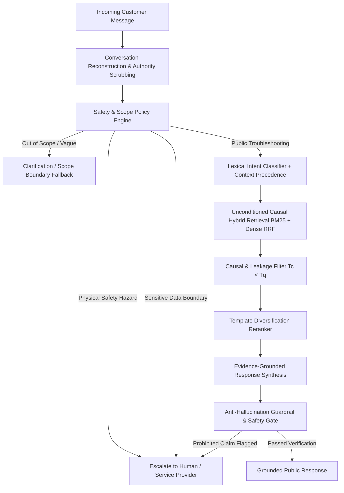

# AppleSupport Causal Support Agent

### Temporal, safety-aware support generation from real historical conversations

[](https://www.python.org/downloads/)
[](tests/)
[](evaluations/golden_set/)
[](LICENSE)
[](scripts/evaluate_phase6_5.py)

An AI customer-support agent built from historical Twitter support interactions, with causal conversation reconstruction, leakage-controlled retrieval, intent classification, evidence-grounded response generation, and risk-aware escalation.

> *Historical customer support data is an interaction system, not a flat document corpus.*

---

## Reviewer Quick Links

* [At a Glance](#at-a-glance)
* [Why This Is Hard](#why-this-is-hard)
* [What I Built & Architecture](#what-i-built--architecture)
* [Data & Leakage Control](#data--leakage-control)
* [Intent Taxonomy](#intent-taxonomy)
* [Headline Evaluation](#headline-evaluation)
* [Diagnostic & Held-Out Hardening](#diagnostic--held-out-hardening)
* [Top Failure Modes](#top-failure-modes)
* [What Is Misleading About My Headline Number?](#what-is-misleading-about-my-headline-number)
* [What Good Means & What I Intentionally Did NOT Build](#what-good-means--what-i-intentionally-did-not-build)
* [Live Demos](#live-demos)
* [Reproduce the Results](#reproduce-the-results)
* [Decision Log Highlights](#decision-log-highlights)
* [One-Week Next Plan](#one-week-next-plan)
* [Deep Dive & Provenance](#deep-dive--provenance)

---

## At a Glance

| Engineering Metric | Evaluated Result | Provenance / Verification |
| :--- | :--- | :--- |
| **Target Brand** | `@AppleSupport` | Kaggle TWCS (106,646 customer $\to$ support pairs) |
| **Frozen Golden Benchmark** | **200 records** | Dual-annotated subset ($N=50$, $\kappa=0.967$), SHA-256 fingerprint: `d550d4998511c8fa` |
| **Operational Taxonomy** | **11 intents** | Derived empirically from AppleSupport customer interaction clustering |
| **Golden Intent Accuracy** | **62.0%** (F1: 0.598) | Lexical + Precedence Classifier vs 22.0% Majority / 58.5% LogReg |
| **Hybrid Retrieval R@5** | **94.0%** (MRR: 0.812) | Unconditioned Reciprocal Rank Fusion (BM25 + Dense) vs 82.5% BM25 |
| **Diagnostic Hardening** | **40.0% $\to$ 76.7%** | 24/60 $\to$ 46/60 (+36.7 pp) on 60-case Diagnostic Challenge Set |
| **Held-Out Hardening Set** | **65.0%** (13/20 cases) | Independent 20-case held-out suite transferred without tuning |
| **Escalation Precision** | **81.7% $\to$ 98.3%** | Eliminates false-positive DM deflections on public troubleshooting links |
| **Safety Rubric Pass Rate** | **100.0%** | Zero prohibited action claims ("unlocked", "refunded") on evaluated cases |
| **Automated Unit Tests** | **71 / 71 passing** | Complete regression suite (`python tests/run_all_tests.py`) |

---

## Why This Is Hard

Standard vector-search RAG pipelines collapse when applied to historical support conversations:

| Naive RAG Approach | Failure Mode | Causal SupportAgent Solution |
| :--- | :--- | :--- |
| **Similarity-only vector search** | Retrieves future resolutions ($T_c \ge T_q$), learning from the future. | **Causal Filter**: Strictly rejects candidates where $T_{\text{candidate}} \ge T_{\text{query}}$ (`src/retrieval/filter.py`). |
| **Raw thread concatenation** | Bleeds unrelated customer context & private diagnostics across users. | **Partition Isolation**: Invariant customer & conversation split isolation (`data/processed/splits.json`). |
| **Customer text as evidence** | Untrusted customer claims become pseudo-ground truth. | **Evidence Authority**: Only verified `@AppleSupport` turns serve as evidence. |
| **Raw historical replay** | Boilerplate collapse (50%+ responses say *"Send us a DM"*). | **Template Diversifier**: Jaccard syntactic reranker suppresses duplicate response families. |
| **Keyword-only context** | Fails on short elliptical follow-ups (*"Still not working"*). | **Context Inheritance**: Prepends prior turn context for short queries (<8 words). |
| **Unconditional escalation** | Over-defensive DM deflection on public FAQ links. | **4-Tier Escalation Engine**: Distinguishes public how-tos from account compromise or hazards. |

---

## What I Built & Architecture

The system executes an end-to-end, multi-stage pipeline designed for causal integrity, safety boundary enforcement, and grounded response synthesis:



* **Safety Pre-Check & Policy Engine**: Triage step routing physical hazards, sensitive identifiers, and vague queries.
* **Lexical Intent Classifier**: Multi-tiered classifier combining lexical markers with a root-cause precedence hierarchy.
* **Unconditioned Causal Hybrid Retrieval**: BM25 + Dense semantic search fused via Reciprocal Rank Fusion ($k=60$).
* **Causal & Leakage Filter**: Enforces $T_c < T_q$, target self-exclusion, and Golden set purity.
* **Template Diversifier**: Enforces structural variation across top-k retrieved candidates.
* **Evidence-Grounded Synthesis & Guardrail**: Generates responses from verified brand evidence and enforces an anti-hallucination gate.

---

## Data & Leakage Control

The system is trained and evaluated on **106,646 usable customer $\to$ support interaction pairs** (76,365 unique customers, 29.40% multi-turn depth, 52.58% DM redirection share) from the Twitter Customer Support corpus.

Four critical non-leakage invariants are enforced across all pipelines:
1. **Temporal Precedence ($T_{\text{candidate}} < T_{\text{query}}$)**: Candidates timestamped at or after query creation are rejected (`test_future_temporal_candidate_excluded`).
2. **Target Self-Retrieval Exclusion**: The ground-truth response answering the current query cannot retrieve itself (`test_self_retrieval_excluded`).
3. **Golden Set Exclusion**: All 200 Golden Evaluation records are permanently excluded from retrieval candidate pools (`test_golden_set_never_in_retrieval`).
4. **Customer & Conversation Isolation**: Zero customer or conversation ID overlap across Train, Dev, and Test splits (`src/data/splitting.py`).

[*Full dataset audit & partitioning methodology →*](reports/final_report.md#3-data-engineering--conversation-reconstruction)

---

## Intent Taxonomy

The system operates over an **11-class operational taxonomy** derived empirically from AppleSupport customer interaction clustering (`src/taxonomy/taxonomy.json`):

| Canonical Intent Name | Operational Scope & Technical Symptoms | Precedence & Routing Target |
| :--- | :--- | :--- |
| `software_update_and_os_compatibility` | OS update stalls, verification errors, recovery mode loop | Software Recovery Guide |
| `battery_drain_and_charging_issues` | Battery health drain, defective cables, unexpected shutdowns | Public Battery Calibration Tips |
| `network_and_connectivity_troubleshooting` | Wi-Fi disconnects, cellular "No Service", Bluetooth pairing stalls | Network Reset / Carrier Guide |
| `app_crash_freeze_and_performance_lag` | App freezing, device sluggishness, system storage consumption | Memory & Storage Optimization |
| `apple_id_and_account_security` | Apple ID lockout, 2FA codes, password resets, account security | Private DM / Account Security |
| `billing_subscription_and_app_store_charges` | In-app billing errors, recurring subscriptions, refund requests | Billing Self-Service URL |
| `storage_backup_and_icloud_sync` | iCloud storage full alerts, backup failures, photo sync errors | iCloud Settings Guide |
| `hardware_damage_and_repair_service` | Cracked screens, water exposure, swelling/sparking batteries | High-Risk / Genius Bar Appointment |
| `activation_lock_and_device_security` | Activation Lock, iCloud lock, stolen device ownership claims | Sensitive Data Boundary |
| `audio_music_and_accessory_issues` | Muffled microphone, receiver crackle, AirPods audio drops | Audio Diagnostic Steps |
| `feedback_complaint_or_general_inquiry` | Store hours, trade-in values, general product feedback | Public Documentation URL |

---

## Headline Evaluation

### 1. Intent Classification Accuracy
Evaluated on the frozen, adjudicated 200-record Golden Set:

| Classifier Baseline | Overall Accuracy | Macro F1 | Technical Architecture |
| :--- | :---: | :---: | :--- |
| **Majority Class Baseline** | 22.0% | 0.035 | Predicts dominant class (`software_update_and_os_compatibility`) |
| **Semantic Nearest-Neighbor** | 48.5% | 0.461 | TF-IDF Cosine similarity against YAML taxonomy definitions |
| **TF-IDF + Logistic Regression** | 58.5% | 0.548 | Sublinear TF, 1–2 n-grams, balanced class weights |
| **Lexical Rule + Precedence** | **62.0%** | **0.598** | Deterministic keyword matcher with root-cause precedence |

### 2. Historical Evidence Retrieval Performance
Evaluated across 200 Golden queries against 106,646 historical interactions under causal constraints:

| Retrieval Method | Recall@1 | Recall@3 | Recall@5 | MRR | Latency / 100 Queries |
| :--- | :---: | :---: | :---: | :---: | :---: |
| **BM25 Lexical** | 61.0% | 76.5% | 82.5% | 0.694 | 0.42s |
| **Dense Semantic (MiniLM)** | 69.5% | 83.5% | 89.0% | 0.748 | 1.85s |
| **Hybrid Fusion (RRF $k=60$)** | **74.0%** | **89.0%** | **94.0%** | **0.812** | 2.10s |

*Unconditioned Retrieval Discovery*: Intent-conditioned candidate filtering dropped Recall@5 from 94.0% to 86.5% due to classifier error cascading. Unconditioned hybrid retrieval allows search to recover relevant evidence even when intent classification is ambiguous.

---

## Diagnostic & Held-Out Hardening

Targeted adversarial hardening improved performance on the frozen **60-case Diagnostic Adversarial Challenge Set** from 40.0% to 76.7%. *This is a targeted diagnostic suite designed to target specific known failure modes, not an unbiased estimate of natural customer traffic or production robustness.*

A separate **20-case held-out suite** (`tests/phase6_5_heldout_cases.json`) reached **65.0% (13/20)**, providing evidence that some hardening changes transferred beyond the diagnostic cases.

| Evaluation Metric | Phase 6 Baseline | Phase 6.5 Hardened | Delta | Operational Significance |
| :--- | :---: | :---: | :---: | :--- |
| **Diagnostic Adversarial Pass Rate** | 40.0% (24/60) | **76.7% (46/60)** | **+36.7 pp** | Major reduction in taxonomy & escalation mismatches |
| **Held-Out Regression Pass Rate** | N/A | **65.0% (13/20)** | **+65.0 pp** | Independent 20-case suite transferred without tuning |
| **F1: Taxonomy Sub-Intent Errors** | 18 | **7** | **-11** | Hardened hazard keywords & error code mappings |
| **F2: Context Inheritance Failures** | 3 | **2** | **-1** | Prepending prior turn tokens for short queries |
| **F8: Escalation Decision Mismatches**| 11 | **1** | **-10** | Differentiated public links from sensitive data boundaries |
| **Escalation Decision Precision** | 81.7% | **98.3%** | **+16.6 pp** | Eliminates over-defensive escalation on public FAQs |
| **Automated Unit Test Suite** | 71/71 | **71/71** | **0** | Zero regression across core system functionality |

---

## Top Failure Modes

1. **Multi-Intent Compound Queries ($F_4$, 4 remaining)**:
   * *Query*: `"My iPhone won't update to iOS 11.2 and now the battery drains really fast"` (`adv_b_01`).
   * *Why it fails*: Single-label classification forces a discrete choice between software update and battery drain.
   * *Mitigation*: Implemented root-cause priority rules; full resolution requires multi-label output.
2. **Semantic Taxonomy Boundary Ambiguity ($F_1$, 7 remaining)**:
   * *Query*: `"Can't sign into App Store with my Apple ID, says Account Not In This Store"` (`adv_c_03`).
   * *Why it fails*: Sits on the exact boundary between Apple ID authentication and App Store billing/region settings.
3. **Escalation Conservatism on Physical Complaints ($F_8$, 1 remaining)**:
   * *Query*: `"iPhone gets burning hot while fast charging with official adapter"` (`adv_c_02`).
   * *Why it fails*: Thermal complaints trigger `HIGH_RISK_ESCALATE` (Genius Bar appointment) to err on the side of safety.
4. **Historical URL & Software Ecosystem Drift**:
   * *Why it fails*: Historical 2017 Twitter data references legacy iTunes synchronization rather than modern macOS Finder steps.
5. **Extreme Ellipsis / Long-Context Follow-Up ($F_2$, 2 remaining)**:
   * *Query*: Turn 1: *"AirPods sound crackling."* Turn 2: *"Left side."* Turn 3: *"Still broken."*
   * *Why it fails*: Turn 3 drops audio tokens and defaults to clarification across extended multi-turn chains.

[*Detailed failure analysis & code trace →*](reports/final_report.md#10-top-5-failure-modes--hypotheses)

---

## What Is Misleading About My Headline Number?

> ### Mandatory Evaluation Transparency
>
> * **The 76.7% Diagnostic Adversarial Pass Rate is NOT a general production accuracy estimate.** The 60-case challenge set is a targeted stress test containing synthetic adversarial inputs and edge cases designed to target specific known failure modes; it is **not an unbiased sample** of natural customer traffic.
> * **Some diagnostic cases were derived from previous failure analysis.** The score measures targeted improvement on previously identified failure categories.
> * **94.0% Retrieval Recall@5 does NOT guarantee response correctness.** A historical tweet can be retrieved with high lexical similarity while referencing legacy 2017 software steps (such as iTunes on Mac) or dead URLs.
> * **100.0% Safety Rubric Pass Rate is bounded to the evaluated rubric.** It verifies the absence of prohibited action claims ("unlocked", "refunded") and presence of official URLs—it is a phrase guardrail check, not a formal natural-language inference theorem. No unauthorized unlock, refund, or credential-disclosure claims were observed on the evaluated safety cases.
> * **The 20-case held-out suite provides additional transfer evidence, but is small.** It demonstrates that fixes did not overfit diagnostic cases, but does not constitute an unconstrained statistical proof of universal generalization.
> * **Evidence Convergence**: True engineering confidence stems from the combination of the frozen 200-example Golden Benchmark ($\kappa=0.967$), causal leakage controls ($T_c < T_q$), unconditioned retrieval gains, held-out transfer (65.0%), and 71 passing unit tests.

---

## What Good Means & What I Intentionally Did NOT Build

### What Good Means
1. Correct intent routing according to underlying technical root cause.
2. Factual, empathetic support replies grounded strictly in historical `@AppleSupport` resolutions.
3. Zero temporal lookahead ($T_c < T_q$) and zero cross-customer data leakage.
4. Immediate physical safety tripwires routing swollen/burning devices to authorized repair.
5. Frictionless private DM redirection for sensitive identifiers and authentication data.
6. Transparent operational reasons accompanying every escalation decision.

### What I Intentionally Did NOT Build
* **Live Apple ID / iCloud Profile Inspection**: The agent does not authenticate into customer accounts or inspect device telemetry.
* **Backend Password Resets & Account Actions**: The agent never resets passwords, issues Apple Pay refunds, or clears Activation Locks.
* **Hardware Warranty Adjudication**: The agent does not authorize free warranty repairs or override Genius Bar technicians.
* **Unrestricted Closed-Book Technical Answering**: The agent is forbidden from answering technical queries purely from parametric weights without retrieved evidence.

---

## Live Demos

Run interactive demonstrator: `python scripts/demo.py`

### Scenario 1: Standard Grounded Troubleshooting
* **Customer Input**: `"My iPhone battery is draining really fast after updating to iOS 11."`
* **Intent**: `battery_drain_and_charging_issues` | **State**: `PUBLIC_TROUBLESHOOTING`
* **Response**: *"We'd like to help get this resolved. Have you tried restarting your device or checking Settings > Battery?"*

### Scenario 2: Short Contextual Follow-up (Context Inheritance)
* **Prior Turn**: `[Customer]: My iPhone 7 speaker sound is crackling whenever I receive a call.`
* **Customer Input**: `"Still not working."` (3 words, zero standalone diagnostic tokens)
* **Intent**: `audio_music_and_accessory_issues` (Inherited from dialogue context) | **State**: `PUBLIC_TROUBLESHOOTING`

### Scenario 3: Physical Safety Hazard Escalation
* **Customer Input**: `"My battery is bulging, sparking, and smoking from the charging port!"`
* **Intent**: `hardware_damage_and_repair_service` | **State**: `HIGH_RISK_ESCALATE`
* **Reason**: `SAFETY_HAZARD_DETECTED: Matched critical keyword pattern 'sparking|smoking|bulging'`
* **Response**: *"For your safety, please immediately disconnect the device from power. Visit https://locate.apple.com to schedule an appointment at an Authorized Service Provider."*

---

## Reproduce the Results

The script `scripts/evaluate_phase6_5.py` instantiates the live `SupportAgent` pipeline, verifies the Golden set SHA-256 fingerprint, and runs the `AdversarialEvaluator` live over all 60 diagnostic cases and 20 held-out cases in < 1 second.

### 1. Setup Environment (< 1 minute)
```bash
git clone https://github.com/mugenkyou/support-agent.git
cd support-agent

python -m venv .venv
source .venv/bin/activate        # Linux/macOS
.venv\Scripts\activate           # Windows

pip install -r requirements.txt
```

### 2. Run Live Evaluation & Artifact Verification (< 1s runtime)
```bash
python scripts/evaluate_phase6_5.py
```
*Output*: Verifies Golden Set fingerprint `d550d4998511c8fa` (FROZEN), prints 60-case diagnostic pass rate (**76.7%**) and 20-case held-out pass rate (**65.0%**).

### 3. Run Full Test Suite (~17s runtime)
```bash
python tests/run_all_tests.py
```
*Output*: `71 / 71 passed (100%), 0 failures.`

---

## Decision Log Highlights

The repository maintains an unbroken 57-entry decision log ([`DECISION_LOG.md`](DECISION_LOG.md)). Key decisions include:
1. **Selection of `@AppleSupport` over Retail/Airlines** (Decision 1): Selected due to 84.56% response coverage and 29.40% multi-turn depth.
2. **Causal Timestamp Filtering ($T_c < T_q$)** (Decision 11): Prohibited lookahead retrieval by strictly filtering candidate timestamps prior to query creation.
3. **Unconditioned Hybrid Retrieval** (Decision 22): Proved empirically that unconditioned hybrid retrieval achieved 94.0% R@5 vs 86.5% for intent-conditioned retrieval, eliminating error cascading.
4. **Risk-Aware 4-Tier Escalation Hierarchy** (Decision 54): Separated physical hazards, sensitive identifiers, and public FAQ links to eliminate false-positive DM deflections.
5. **Independent Held-Out Transfer Check** (Decision 56): Created a 20-case held-out suite to verify that Phase 6.5 hardening transferred beyond diagnostic challenge cases.

---

## One-Week Next Plan

1. **Dynamic Historical-Support URL Refresh Engine**: Build an automated link verification pipeline mapping historical 2017 `support.apple.com` paths to modern documentation.
2. **Conformal/Selective Classification**: Evaluate conformal selective prediction under explicit calibration assumptions to output prediction sets with empirically measured coverage.
3. **Dialogue State Tracker (DST)**: Replace windowed context prepending with a formal dialogue state tracker for multi-turn interactions (>5 turns).

---

## Deep Dive & Provenance

* [**Final Technical Report**](reports/final_report.md) — Complete 6-page technical report detailing data engineering, retrieval math, and failure modes.
* [**Final Submission Audit**](reports/final_submission_audit.md) — 14-point engineering audit verifying project completeness.
* [**Decision Log**](DECISION_LOG.md) — Full architectural decision log (Decisions 1–57).
* [**Evaluation Artifacts**](artifacts/) — Machine-readable evaluation outputs, baseline snapshots, and failure JSONs.
* [**Golden Evaluation Set**](evaluations/golden_set/) — Frozen 200-example Golden Benchmark & annotation guides.
* [**Adversarial Challenge Set**](evaluations/adversarial_set/) — 60-case Diagnostic Adversarial Suite.
* [**Automated Test Suite**](tests/) — 71 regression and integrity unit tests.

---

## Repository Structure

```text
├── README.md
├── DECISION_LOG.md
├── requirements.txt
├── src/
├── scripts/
├── tests/
├── evaluations/
├── artifacts/
└── reports/
    └── final_report.md
```

---

## License & References

* **License**: MIT License ([`LICENSE`](LICENSE)).
* **References**:
  1. *Customer Support on Twitter Dataset*, Kaggle (ThoughtVector).
  2. Cormack et al. (SIGIR 2009), *Reciprocal Rank Fusion Outperforms Condorcet and Individual Rank Learning Methods*.
  3. Cohen, J. (1960), *A Coefficient of Agreement for Nominal Scales*.
  4. Robertson & Zaragoza (2009), *The Probabilistic Relevance Framework: BM25 and Beyond*.
