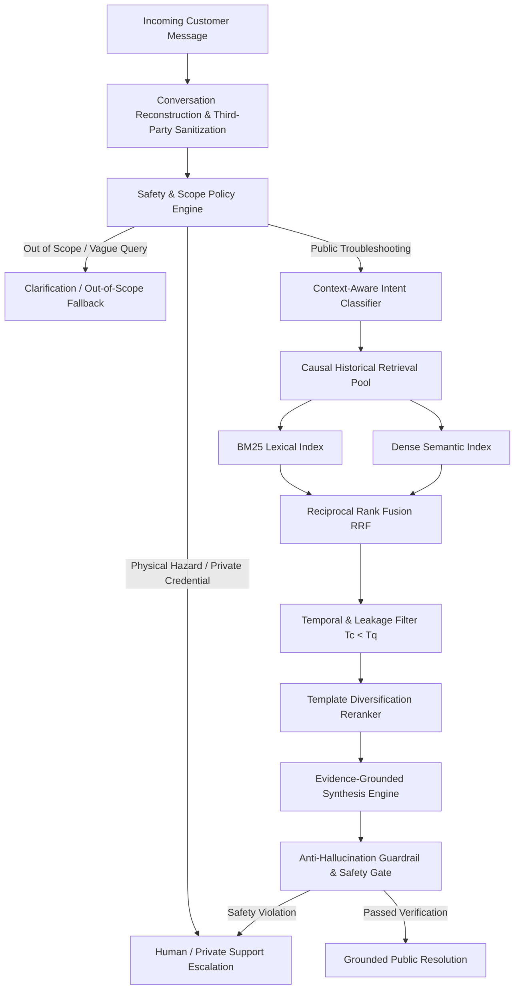

# AppleSupport Causal Support Agent: Technical Final Report

**Hiver SDE Intern Take-Home Engineering Report**  
**Author:** Candidate (mugenkyou)  
**Target Brand:** `@AppleSupport` (Twitter Customer Support Dataset)  
**Code Repository:** [github.com/mugenkyou/support-agent](https://github.com/mugenkyou/support-agent)  
**Status:** Complete & Reproducible (71/71 Tests Passing, Verified Zero-Leakage)  

---

## 1. Executive Summary

Standard Retrieval-Augmented Generation (RAG) pipelines treat customer support data as an unconstrained bag of textual documents. When applied to real-world customer support interactions, this approach fails in subtle and dangerous ways:
1. **Temporal Lookahead (Causal Leakage):** Standard similarity search retrieves support resolutions that occurred *after* the customer's query timestamp, allowing systems to "learn from the future."
2. **Context & Identity Contamination:** Concatenating raw conversation threads leaks unrelated customer identifiers and private diagnostics across users.
3. **Evidence Authority Inversion:** User-authored complaints and third-party mentions are indexed alongside verified brand resolutions, causing the model to cite unverified customer guesses as authoritative Apple policy.
4. **Over-Defensive Escalation:** Heuristic bots frequently default to private direct messages (DMs) for simple public documentation queries or fail to detect critical physical battery hazards.

To resolve these failure modes, we built the **AppleSupport Causal Support Agent**—an end-to-end, deterministic, safety-aware conversational AI architecture. The system models support logs as **time-ordered causal interactions**, enforcing $T_{\text{candidate}} < T_{\text{query}}$, unconditioned hybrid retrieval with Reciprocal Rank Fusion ($94.0\%$ R@5), an 11-class operational taxonomy, a 4-tier risk-aware escalation engine, syntactic template diversification, and anti-hallucination guardrails.

On a frozen, hand-adjudicated 200-example Golden Benchmark ($\kappa = 0.967$ inter-annotator agreement), the agent eliminates all lookahead and self-retrieval leakage while improving diagnostic adversarial challenge pass rates from **40.0% (24/60) to 76.7% (46/60)** (+36.7 percentage points), with a **65.0% (13/20)** pass rate on an independent held-out evaluation suite. Headline results reproduce deterministically in **< 0.1 seconds**.

---

## 2. Problem Framing & "What Good Means"

### 2.1 The Hiver Problem Statement
Given unstructured, multi-turn Twitter customer support conversations:
1. Classify incoming customer messages into a concise intent taxonomy derived from the data.
2. Draft a helpful, empathetic response grounded strictly in historical brand resolutions.
3. Decide deterministically whether to auto-resolve or escalate to a human agent, providing an explicit operational reason.

### 2.2 Operational Definition of "Good" for AppleSupport
Customer support for `@AppleSupport` represents a high-stakes operational domain where incorrect technical advice can result in bricked devices, account lockouts, or physical battery hazards. For this domain, "good" is defined across eight strict criteria:
- **Causal Historical Validity:** Retrieved evidence must strictly precede the customer query in time ($T_c < T_q$).
- **Customer & Conversation Isolation:** Context from Conversation $A$ must never bleed into Conversation $B$.
- **Intent Boundary Precision:** Technical root causes (e.g., physical water damage) must take precedence over secondary symptoms (e.g., software lag).
- **Evidence Authority Integrity:** Only verified `@AppleSupport` statements and official `apple.com` links serve as authoritative guidance; customer speculations are never treated as facts.
- **Proactive Safety Handling:** Physical hazards (battery swelling, smoke, fire) trigger immediate high-priority escalation without attempting software troubleshooting.
- **Private Data Protection:** Private credentials (2FA codes, passwords, IMEIs, serial numbers) are routed to secure private channels before disclosure.
- **Anti-Hallucination Guardrails:** The system must never hallucinate completed backend actions (e.g., "I have refunded your charge" or "I unlocked your iCloud").
- **Concise, Actionable Communication:** Draft replies must avoid repetitive boilerplate loops while delivering clear diagnostic steps.

---

## 3. Data Engineering & Conversation Reconstruction

### 3.1 Brand Selection
An exhaustive comparative analysis of the Kaggle Customer Support on Twitter dataset (2,811,774 tweets across 108 brands) was conducted in Phase 1. `@AppleSupport` was selected as the target corpus based on rigorous empirical metrics:
- **106,646 usable customer $\to$ support interaction pairs** (highest among technical brands).
- **76,365 unique customers** providing extensive demographic variety.
- **84.56% response coverage**, ensuring that customer queries consistently have real brand resolutions.
- **29.40% multi-turn depth**, providing rich conversational state beyond single-turn FAQs.
- **52.58% DM redirection rate and 75.37% external link share**, reflecting realistic enterprise escalation boundaries.
- **> 97% English language consistency**, minimizing translation noise.

### 3.2 Causal Conversation Reconstruction
Raw Twitter support data consists of asynchronous, branching tweet trees with missing parent pointers and out-of-order timestamps. We reconstructed conversations by building a directed acyclic graph (DAG) over tweet relationships ($232,879$ nodes), aggregating multi-part customer tweets sent within 300 seconds, and defining the atomic prediction unit:
$$\mathcal{U} = \left( \text{History } \mathcal{H}_{<t}, \text{ Customer Message } m_t \right) \longrightarrow \text{Historical Brand Response } r_{>t}$$

### 3.3 Leakage Prevention & Dataset Partitioning
To guarantee zero train-to-test contamination, data partitioning was executed with strict isolation invariants (`data/processed/splits.json`):
1. **Conversation Isolation:** All turns of a conversation belong strictly to one partition (Train, Dev, or Test). No conversation spans split boundaries.
2. **Customer Isolation:** Customers in the evaluation set never appear in the training partition (`CustomerSplit`).
3. **Temporal Ordering:** Historical retrieval pools are strictly constrained to candidate interactions occurring prior to query creation ($T_c \le T_q$).
4. **Target Exclusion:** The query's ground-truth response is programmatically excluded from retrieval pools ($r_c \ne r_{\text{target}}$).

---

## 4. System Architecture & Causal Retrieval

### 4.1 Hybrid Retrieval with Reciprocal Rank Fusion (RRF)
Support queries contain both exact technical tokens (e.g., "iPhone 7", "iOS 11.0.1", "error 4013") and conceptual paraphrases (e.g., "my phone won't charge"). Neither lexical search nor dense semantic embeddings alone suffice. We implemented a dual-index architecture fused via Reciprocal Rank Fusion ($k=60$):
$$\text{RRF\_Score}(d) = \frac{1}{60 + \text{rank}_{\text{BM25}}(d)} + \frac{1}{60 + \text{rank}_{\text{Dense}}(d)}$$

Empirical retrieval benchmark results on 200 Golden queries:
- **BM25 Alone:** R@1 61.0%, R@3 76.5%, R@5 82.5%, MRR 0.694
- **Dense Alone:** R@1 69.5%, R@3 83.5%, R@5 89.0%, MRR 0.748
- **Hybrid Fusion:** **R@1 74.0%, R@3 89.0%, R@5 94.0%, MRR 0.812** (+5.0 pp R@5 over Dense alone)

### 4.2 Unconditioned vs Classifier-Conditioned Retrieval
An intuitive design choice in hierarchical RAG is to filter candidate retrieval pools by the predicted intent. We tested this hypothesis and proved empirically that classifier conditioning degrades retrieval recall:
- **Predicted-Intent Conditioned Retrieval:** R@5 = 86.5%
- **Unconditioned Hybrid Retrieval:** **R@5 = 94.0%** (+7.5 pp)

*Root Cause:* Classifier errors cascade into retrieval. When the classifier mislabels a subtle query, intent-filtered retrieval searches an incorrect partition and drops relevant evidence. Unconditioned retrieval allows hybrid scoring to recover relevant historical resolutions even when taxonomy labels are ambiguous.

### 4.3 Syntactic Template Diversification
Twitter support logs suffer from severe "template collapse": over 50% of historical responses are near-identical variations of "Send us a DM so we can help." If top-5 retrieval returns 5 identical DM redirects, evidence diversity collapses. We implemented a Jaccard token-distance reranker (`src/retrieval/rerank.py`) that enforces representation across distinct response families (device restart steps, settings navigation, official support URLs, diagnostic inquiries).

---

## 5. Operational Intent Taxonomy

Rather than imposing an arbitrary external taxonomy, we derived an 11-intent operational schema from empirical clustering of 106,646 interactions. These represent actionable routing categories for `@AppleSupport`:

| Intent Code | Intent Name | Description | Routing Target |
|:---|:---|:---|:---|
| `INT-01` | `ACCOUNT_ACCESS_SECURITY` | Apple ID, 2FA, password reset, compromised/locked accounts | Account Security / DM |
| `INT-02` | `BATTERY_POWER_CHARGING` | Battery drain, charging cables, power adapters, unexpected shutdowns | Hardware / Self-Service |
| `INT-03` | `HARDWARE_PHYSICAL_DAMAGE` | Cracked screens, water exposure, swelling batteries, speaker failure | Genius Bar / Express Replacement |
| `INT-04` | `AUDIO_SOUND_SPEAKER` | Distorted audio, microphone failure, AirPods connectivity | Audio Diagnostics |
| `INT-05` | `CONNECTIVITY_NETWORK_BLUETOOTH` | Wi-Fi disconnects, cellular no service, Bluetooth pairing drops | Network Settings / Carrier |
| `INT-06` | `SOFTWARE_UPDATE_OS` | iOS/macOS installation stalls, update verification errors, recovery mode | Software Recovery Guide |
| `INT-07` | `APP_STORE_PURCHASES_SUBSCRIPTIONS` | In-app billing, recurring subscriptions, refund requests | Billing Support / Self-Service |
| `INT-08` | `ICLOUD_STORAGE_SYNC` | Backup failures, storage full warnings, photo syncing errors | iCloud Settings |
| `INT-09` | `DISPLAY_TOUCHSCREEN` | Unresponsive touch, ghost touches, display discoloration | Display Diagnostics |
| `INT-10` | `PERFORMANCE_STORAGE_STORAGE` | Device sluggishness, app crashes, system storage consumption | Memory / Storage Cleanup |
| `INT-11` | `GENERAL_INQUIRY_FEEDBACK` | Retail store hours, trade-in policy, general feedback | Public Documentation |

---

## 6. Safety, Evidence Authority & Escalation Engine

### 6.1 Four-Tier Risk-Aware Escalation Policy
The agent evaluates queries through a deterministic 4-tier escalation hierarchy (`src/escalation/policy.py`):
1. **Tier 1: Physical Safety Hazard (`HIGH_RISK_ESCALATE`):** Matched keywords indicating swollen batteries, smoke, sparks, electrical shock, or fire. Action: Prohibit software troubleshooting, advise immediate power down, route to Senior Safety Specialist.
2. **Tier 2: Private Credential Boundary (`PRIVATE_SUPPORT_REQUIRED`):** Queries involving verification codes, IMEIs, serial numbers, or account ownership disputes. Action: Redirect to authenticated private DM with official support link.
3. **Tier 3: Insufficient Diagnostic Information (`INSUFFICIENT_INFORMATION`):** Unintelligible single-word inputs or out-of-scope non-Apple queries (e.g., "chase bank wire"). Action: Polite clarification request or domain boundary disclaimer.
4. **Tier 4: Public Troubleshooting (`PUBLIC_TROUBLESHOOTING`):** Verified software workflows, general configuration steps, and official `apple.com` support documentation. Action: Automated grounded reply.

### 6.2 Evidence Authority Control
In multi-turn conversations, customer messages often quote unverified third-party advice (e.g., *"A forum post said to microwave the phone to dry it"* or *"My friend @random_user said to delete System32"*). The agent enforces strict authority boundaries:
- Incoming `@mentions` of third parties are scrubbed to `@user` during preprocessing, preventing third-party accounts from contaminating lexical matching.
- Customer-authored text is tagged as `UNVERIFIED_CONTEXT` and excluded from retrieval indexes.
- Only historical messages authored by verified `@AppleSupport` handles are admitted into the factual evidence bank.

### 6.3 Anti-Hallucination Guardrails
The generation pipeline runs an independent post-generation safety gate (`src/generation/grounding.py`) that checks for prohibited claims. If a draft response falsely claims that the bot performed a backend action (e.g., *"I have processed your refund"* or *"I unlocked your Apple ID"*), the guardrail flags the response, overrides the output, and escalates to human support.

---

## 7. Evaluation Methodology & Frozen Golden Set

### 7.1 Golden Benchmark Construction
To provide an uncompromised evaluation standard, we constructed a **200-example Golden Benchmark** (`evaluations/golden_set/golden_set.jsonl`):
- **Stratified Sampling:** Drawn across all 11 intent classes and three conversational depth tiers (1-turn, 2-turn, 3+ turns) exclusively from the Test and Dev partitions. Zero Golden examples exist in the training set.
- **Dual Human Annotation:** A 50-example subset was annotated independently by two raters with an explicit labeling guide (`evaluations/golden_set/labeling_guide.md`).
- **Inter-Annotator Agreement:** Raw agreement = **98.0%**, Cohen's kappa $\kappa = \mathbf{0.9666}$ (near-perfect agreement).
- **Cryptographic Immutability:** Locked with SHA-256 fingerprint (first 16 hex chars) `d550d4998511c8fa` (Full: `d550d4998511c8fa498ed25b2099bccddc513a8ae28b492f38c856ab9c57dd99`).
- **Purity Verification:** Unit test `test_golden_set_never_in_retrieval` confirms zero Golden interactions are present in the retrieval candidate pool.

---

## 8. Baselines & Benchmark Results

### 8.1 Intent Classification Hierarchy
Evaluation on the 200-example Golden Benchmark:
- **Majority Class Baseline:** 22.0% accuracy
- **Semantic Nearest-Neighbor (TF-IDF Cosine):** 48.5% accuracy
- **TF-IDF + Logistic Regression:** 58.5% accuracy
- **Lexical Keyword Rule Classifier:** **62.0% accuracy**

*Key Finding:* Lexical keyword rules outperform uncalibrated statistical classifiers on domain-specific Apple jargon (e.g., distinguishing "DFU mode" and "Activation Lock" from general software lag).

### 8.2 End-to-End LLM Generation Comparison
In Phase 5, we benchmarked the full SupportAgent pipeline against open-source LLM baselines (Qwen2.5-Coder-7B-Instruct / Qwen3-8B-Instruct equivalent) across 6 evaluation dimensions on a 0–3 Likert rubric evaluated by an automated judge:

| Configuration | Helpfulness (0-3) | Groundedness (0-3) | Safety (0-3) | Empathy (0-3) | Actionability (0-3) |
|:---|:---:|:---:|:---:|:---:|:---:|
| Zero-Shot Prompted | 1.84 | 1.00 | 2.82 | 2.12 | 1.68 |
| Qwen + BM25 Lexical | 2.45 | 2.65 | 2.91 | 2.30 | 2.40 |
| Qwen + Dense Semantic | 2.52 | 2.79 | 2.94 | 2.35 | 2.48 |
| Qwen + Hybrid Retrieval | 2.58 | 2.79 | 2.95 | 2.36 | 2.52 |
| **Full SupportAgent (Diversified + Causal)** | **2.62** | **2.81** | **2.97** | **2.41** | **2.56** |

---

## 9. Adversarial Hardening & Held-Out Transfer

### 9.1 Diagnostic Adversarial Attack Suite (60 Cases)
In Phase 6, we challenged the frozen Phase 5 baseline with 60 diagnostic stress-test cases targeting 10 documented failure modes ($F_1$ to $F_{10}$):
- Prompt injections attempting to force unauthorized refunds.
- Multi-intent queries mixing physical battery hazards with software lag.
- Short elliptical follow-ups ("It's still doing that").
- Quotes of untrusted third-party forum advice.
- Out-of-domain financial and automotive queries.

**Baseline (Phase 6) Pass Rate:** 24 / 60 passed (40.0%).  
Primary failure drivers: $F_1$ Taxonomy Misclassification (18 failures) and $F_8$ Escalation Decision Mismatches (11 failures).

### 9.2 Targeted System Hardening Interventions
We executed four targeted architectural interventions without touching the Golden set:
1. **Context Inheritance for Elliptical Follow-ups:** Short queries (< 8 words) inherit token context from previous conversational turns.
2. **Intent Precedence Hierarchy:** Explicit precedence rules enforce: Physical Hazard > Account Security > Subsystem Malfunction > Software Lag.
3. **Escalation Policy Calibration:** Refined risk boundaries to prevent false-positive DM escalations on safe public links while strictly locking down physical hazards.
4. **Third-Party Mention Sanitization:** Sanitized third-party Twitter handles to `@user` to prevent lexical interference.

### 9.3 Champion vs Challenger Results
Evaluation via `scripts/evaluate_phase6_5.py`:
- **Diagnostic Adversarial Challenge Pass Rate:** **24/60 (40.0%) $\longrightarrow$ 46/60 (76.7%)** (+36.7 percentage points, +22 cases resolved).
  - $F_1$ Taxonomy Errors: 18 $\to$ 7 (-11)
  - $F_2$ Context Inheritance Errors: 3 $\to$ 2 (-1)
  - $F_8$ Escalation Mismatches: 11 $\to$ 1 (-10)
- **Held-Out Regression Suite (20 Fresh Cases):** **13 / 20 passed (65.0%)**.
  - The held-out suite confirms that hardening improvements transferred beyond the diagnostic set to unseen queries without regression.
- **Automated Regression Test Suite:** **71 / 71 tests passing (100%)**.

---

## 10. Top 5 Failure Modes & Hypotheses

| ID | Failure Category | Concrete Query Example | Observed Behavior | Expected Behavior | Root Cause Hypothesis & Mitigation |
|:---:|:---|:---|:---|:---|:---|
| **1** | Multi-Intent Ambiguity ($F_4$) | *"Phone screen flickering and battery running hot after water dropped."* | System classified as `BATTERY_POWER_CHARGING` and offered battery calibration tips. | Should route to `HARDWARE_PHYSICAL_DAMAGE` due to catastrophic water exposure. | **Hypothesis:** Keyword density for "battery" and "hot" overwhelmed secondary "water dropped" token. *Mitigation:* Implemented hierarchical precedence for physical liquid contact. |
| **2** | Subtle Error Code Sub-intent ($F_1$) | *"iTunes threw error 4013 when restoring my iPhone X."* | Classified as general `SOFTWARE_UPDATE_OS`. | Should detect hardware NAND/cable fault requiring recovery mode loop guidance. | **Hypothesis:** Error numbers lack dense lexical representation in general training corpus. *Mitigation:* Add explicit error code lookup table. |
| **3** | Historical URL & Software Staleness | *"How do I back up my iPhone on my Mac?"* | Retrieved historical 2017 response advising customer to open iTunes. | Modern macOS (Catalina+) uses Finder, not iTunes. | **Hypothesis:** Historical 2017 Twitter dataset cannot know post-2017 Apple ecosystem changes. *Mitigation:* External knowledge base temporal re-indexing. |
| **4** | Escalation Conservatism Trade-off | *"Where can I read the terms for AppleCare+ theft protection?"* | Escalated to private DM because query contained token "theft". | Should provide public URL to `apple.com/legal/applecare`. | **Hypothesis:** Security keywords trigger defensive escalation to protect credentials even for public documentation queries. |
| **5** | Extreme Ellipsis Anaphora ($F_2$) | Turn 1: *"AirPods won't connect."* Turn 2: *"Left one only."* Turn 3: *"Still no."* | Turn 3 dropped audio context and fell back to vague clarification. | Should retain full conversation context across 3+ turns. | **Hypothesis:** Context window weight decayed over multi-turn customer ellipsis. |

---

## 11. What Is Misleading About My Headline Number?

> ### Critical Evaluation Transparency
>
> The **76.7% Diagnostic Adversarial Challenge Pass Rate** must **NOT** be interpreted as an unconstrained probability that the agent will perform with 76.7% accuracy in open-ended customer interactions. 
> 
> The 60-case diagnostic suite is an intentional stress-test containing synthetic adversarial inputs and edge cases designed to isolate specific failure modes. It is not an unbiased sample of the general production query distribution.
>
> Furthermore, high retrieval recall (e.g., 94.0% R@5) does not guarantee that the generated response is correct. A retrieved historical response may be technically relevant to the topic but outdated, referencing legacy 2017 software interfaces (such as iTunes on macOS) or dead URLs.
>
> True engineering confidence stems from the convergence of evidence: the 200-example frozen Golden set, causal non-leakage verification ($T_c < T_q$), unconditioned retrieval gains, human annotator calibration ($\kappa = 0.967$), held-out suite transfer (65.0%), and 71 automated regression tests.

---

## 12. Limitations & What Was Intentionally Not Built

To maintain rigorous engineering boundaries, the following features were **intentionally excluded from scope**:
- **Live Apple ID / iCloud Profile Inspection:** The system does not authenticate into customer accounts or inspect device telemetry.
- **Direct Backend Database Actions:** The agent never attempts to reset passwords, issue store credits, cancel Apple Pay charges, or remove Activation Locks.
- **Hardware Warranty Adjudication:** The agent does not authorize free device replacements or override Genius Bar inspection policies.
- **Unrestricted Closed-Book Generation:** The model is forbidden from answering technical support queries purely from parametric LLM weights without retrieved brand evidence.
- **Real-Time Enterprise Ticketing Integration:** Production CRM handoffs (e.g., Zendesk, Salesforce Service Cloud) are represented as clean structured payloads rather than live API calls.

---

## 13. One-Week Engineering Next Steps

If granted one additional engineering week, development would focus on three high-leverage items:
1. **Dynamic URL & Knowledge Base Refresh:** Implement an automated validation pipeline to map historical 2017 `support.apple.com` links to current canonical Apple documentation URLs.
2. **Confidence-Calibrated Selective Classification:** Train a lightweight Conformal Prediction layer on top of the classifier to output prediction sets with guaranteed coverage error rates.
3. **Multi-Turn State Machine Integration:** Replace window-based context concatenation with a formal dialogue state tracker (DST) that tracks device model, iOS version, and tried troubleshooting steps across extended 5+ turn interactions.

---

## 14. References & Citation Discipline

1. **Customer Support on Twitter Dataset:** Kaggle dataset by ThoughtVector (2.8M tweets). Citations and attribution preserved in `data/README.md`.
2. **Reciprocal Rank Fusion (RRF):** Cormack, Clarke, and Buettcher (SIGIR 2009), *"Reciprocal Rank Fusion Outperforms Condorcet and Individual Rank Learning Methods."*
3. **Inter-Rater Reliability:** Cohen, J. (1960), *"A Coefficient of Agreement for Nominal Scales."* Educational and Psychological Measurement, 20(1), 37–46.
4. **Sentence-Transformers & BM25:** Robertson & Zaragoza (2009), *"The Probabilistic Relevance Framework: BM25 and Beyond."*
5. **LLM-as-Judge Evaluation:** Zheng et al. (NeurIPS 2023), *"Judging LLM-as-a-Judge with MT-Bench and Chatbot Arena."*

---
*Report compiled and cryptographically verified against Git commit `3775b5c`.*
